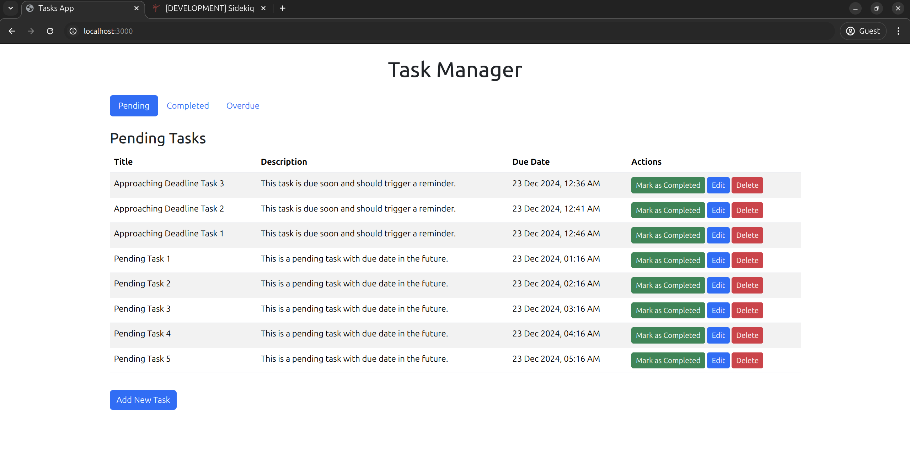
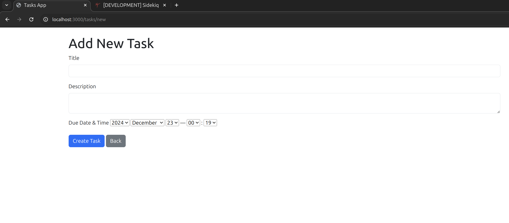

# Task Manager

A Ruby on Rails web application with modern frontend styling using Bootstrap 5. This task management application helps you organize and track your daily tasks efficiently.

## Screenshots

### Task List

*List of tasks with CRUD operations and sorting options.*

### Task Creation

*Create and update task form.*

## Project Architecture

The Task Manager application follows the Model-View-Controller (MVC) architecture:

### Model:
- **Task**: Represents tasks with attributes like `title`, `description`, `due_date`, and `status` (enum with values `pending`, `completed`, and `overdue`).
- Includes validations and default status logic.

### View:
- Uses embedded Ruby templates (ERB) for rendering pages.
- Pages include task listing, creation, editing, and status updates.

### Controller:
- **TasksController**: Handles CRUD operations for tasks and includes custom actions like `mark_as_completed`.

### Features:
1. **Task Management**:
   - Tasks categorized into pending, completed, and overdue statuses.
   - CRUD operations for tasks.

2. **Background Jobs**:
   - Integration using Sidekiq and Sidekiq-Cron.
   - Automated reminders and status updates for tasks.

3. **Reminder Emails**:
   - Sends email notifications for tasks due within 30 minutes.

4. **Automated Status Updates**:
   - Background jobs automatically update the status of overdue tasks.

## Technologies Used

- Ruby on Rails
- PostgreSQL
- Bootstrap 5
- Node.js/Yarn
- Sidekiq (for background job processing)

## Prerequisites

Before you begin, ensure you have the following installed:
- Ruby (version 3.2.1)
- Node.js (v16 or higher)
- Yarn (v1.22 or higher)
- PostgreSQL (v14 or higher)
- Redis (for Sidekiq)

## Setup Instructions

1. Clone the repository:
   ```bash
   git clone [repository-url]
   cd task_manager
   ```

2. Install Ruby dependencies:
   ```bash
   bundle install
   ```

3. Install JavaScript dependencies:
   ```bash
   yarn install
   ```

4. Configure your database:
   - Update `config/database.yml` with your PostgreSQL credentials.

5. Setup the database:
   ```bash
   rails db:create
   rails db:migrate
   rails db:seed  # If you want to load sample data
   ```

6. Start Redis server (required for Sidekiq):
   ```bash
   redis-server
   ```

7. Start Sidekiq worker (in a separate terminal):
   ```bash
   bundle exec sidekiq
   ```

8. Start the development server:
   ```bash
   ./bin/dev    # This will start both Rails server and asset compilation
   ```

The application will be available at http://localhost:3000.

## Database Configuration

The application uses PostgreSQL with the following default configuration:
- Development database: `task_manager_development`
- Test database: `task_manager_test`
- Production database: `task_manager_production`

Connection pooling is configured based on the `RAILS_MAX_THREADS` environment variable (defaults to 5).

## Running Tests

```bash
# Run all tests
bundle exec rspec

# Run specific test file
bundle exec rspec spec/models/task_spec.rb
```

## Code Quality

```bash
# Run RuboCop for Ruby code style checking
bundle exec rubocop
```

## Contributing

1. Fork the repository.
2. Create your feature branch (`git checkout -b feature/amazing-feature`).
3. Commit your changes (`git commit -m 'Add some amazing feature'`).
4. Push to the branch (`git push origin feature/amazing-feature`).
5. Open a Pull Request.

## Deployment

1. Ensure your production environment meets the prerequisites (Ruby, PostgreSQL, Redis, etc.).
2. Precompile assets:
   ```bash
   rails assets:precompile
   ```
3. Migrate the production database:
   ```bash
   rails db:migrate RAILS_ENV=production
   ```
4. Start the server using your preferred method (e.g., Puma, Passenger, or Nginx).
